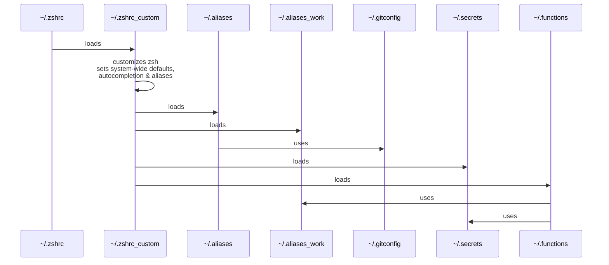

<div align=center>

  # dotfiles

  Your dotfiles are how you personalize your system. These are mine.

  I went back & forth scripting & bootstrapping dotfiles, but after time ended once more embracing _KISS_ philosophy.

  **Simplicity is divine**.

  
  
  

</div>

# structure

```
├── bin/
│   ├── install_kubie  # script to install/configure https://github.com/sbstp/kubie
│   └── vpn-fix        # script to fix routes when using corporate vpn
|
├── setup/             # --> read: [setup] below
│   ├── brew.sh
│   ├── files.sh
│   ├── system.sh
|   └── zsh.sh
|
├── .actrc             # https://github.com/nektos/act config
├── .aliases           # shell aliases
├── .functions         # --> read: [zsh customization] below
├── .gitconfig         # git configuration & aliases
├── .vimrc             # vim FTW
└── .zshrc_custom      # --> read: [zsh customization] below
```

---

# setup

Run the scripts in folder `setup/`, in this order:

```
└── setup/
    ├── brew.sh        # installs homebrew & tools with brew
    ├── files.sh       # installs dotfiles from this repo (backing up existing files)
    ├── system.sh      # tweaks the OS (macOS only)
    └── zsh.sh         # installs plugins, calls ~/.zshrc_custom and reloads zsh
```

---

# zsh customization

In the previous step:

- `setup/files.sh` will put dotfiles from this repository into `${HOME}/`, previously backing up any existing files
- `setup/zsh.sh` will make sure `~/.zshrc` calls `~/.zshrc_custom` on startup

Now this is how it works:



All additional files are sourced **only if present**. If you want to make use of them, you have to create them. ge:

- `~/.aliases_work` is where all work-related aliases & variables can live - example:
  - `OCI_REGISTRY_URI`
  - `ARTIFACTORY_URI`
  - `AWS_ACCOUNT_1`
- `~/.secrets` is where sensitive data should be kept safe - example:
  - `OCI_REGISTRY_USERNAME`
  - `OCI_REGISTRY_PASSWORD`
  - `ARTIFACTORY_USERNAME`
  - `ARTIFACTORY_PASSWORD`
